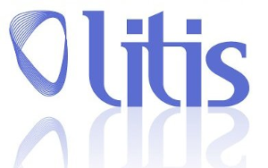
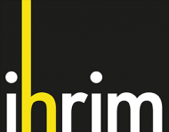
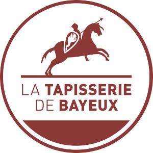

# Les differentes équipes

## LITIS 
Le Laboratoire d'Informatique, du Traitement de l'Information et des Systèmes (LITIS) est l'unité de recherche dans le domaine des sciences et technologies de l'information de Haute-Normandie. Il implique les trois principaux établissements d'enseignement supérieur de la région :

+ Université de Rouen
+ Université du Havre
+ Institut National des Sciences Appliquées (INSA)

Pour plus d'informations :
### <a href="https://www.litislab.fr">www.litislab.fr</a>

## GREYC
Le Laboratoire GREYC réalise des activités de recherche dans le domaine des sciences du numérique couvrant plusieurs aspects en informatique dont le traitement des images, la fouille de données,  l’intelligence artificielle, la sécurité informatique, l’informatique mathématique, traitement automatique des langues, électronique et instrumentation. 

Pour plus d'informations :
### <a href="https://www.greyc.fr">www.greyc.fr</a>

## IHRIM
Institut d’Histoire des Représentations et des Idées dans les Modernités.

Pour plus d'informations :
### <a href="http://ihrim.ens-lyon.fr/">www.ihrim.ens-lyon.fr</a>

### Musée de la tapisserie de Bayeux

 
