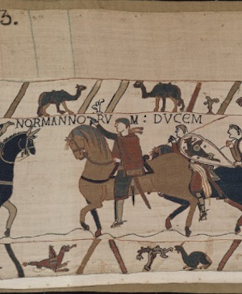
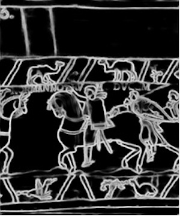
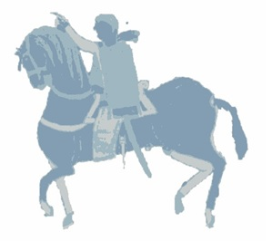
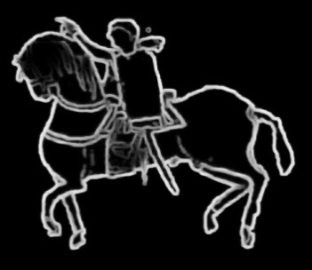
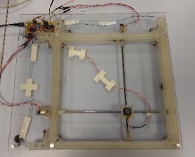
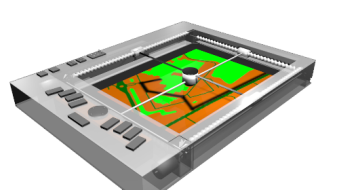

# 1. Introduction

Access to art and culture for people with visual impairments (PPIV) is often complex, with the majority of works exhibited in museums based on the visual dimension.
Solutions to overcome this problem currently exist, such as audio descriptions or the creation of 3D models allowing tactile exploration of the work. However, these solutions bring their share of limitations: audio descriptions are sequential and passive because they require listening and monopolize the attention of the user. 3D printing or thermoformed media is generally expensive to manufacture and produces too much detail to the touch, which requires the assistance of a person to assist in understanding.

Autonomous tactile exploration constitutes a current challenge and requires a simplification of forms. However, each work of art being specific, classical automatic methods do not provide a universal adaptive solution. It is more important that an active exploration (guided by the glance or the finger) allows a mental representation of the object, which audio descriptions do not always offer because they are often designed by people without visual impairment.

In order to improve accessibility to art and culture for PPIV, we are developing a material solution allowing to display “transformed” works of art combining tactile, kinesthetic and audio perceptions, and allowing their active exploration, as well as software solutions to facilitate simplification towards this multimodal representation.

# 2. Tactile representation of a work
    
A work must above all have outlines highlighted to detect the objects represented, their number and their location relative to the other objects that are part of this work. To distinguish the objects in the image (foreground and second plane), the simplification of the image must allow a better understanding for the observer who will thus have knowledge of the borders and categories of objects represented.

Perspective, a visual element, hinders recognition. A drawn object, simply highlighted (2D ½) has little to do with the tactile experience of this object. The projection of an object on a surface always corresponds to visual cues. Its recognition depends on the cultural assumptions of our memory. So you have to learn to interpret this type of image. A tactile representation must be simplified compared to a visual representation by keeping only the essential information allowing its recognition. It must "preserve the overall meaning" of the object represented [[1]](#ref1)

# 3. Semantic segmentation
    

Semantic segmentation makes it possible to group parts of the image into simplified categories. Two approaches are possible to understand the simplification of a work of art: (1) Detection of the contours of the elements visible in the painting; (2) Segmentation of regions belonging to an element compared to other regions.

These two classes of methods aim to simplify the image by eliminating or greatly simplifying the information contained (colors, details, etc.) and by separating the content into coarse zones corresponding to the borders of known elements, making it possible to facilitate the interpretation of the spatial organization of the content of the image.

### 3.1 Edge detection

Edge detection consists of identifying the edges of the salient elements of a table in relation to the contrast of the pixels. Conventional methods (high pass filters / sharpening kernels, Canny, etc.) do not allow complete contours because they depend on the lighting and texture of the images.

The HED (Holistically Nested Edge Detection) approach is an architecture of end-to-end convolutional neural networks [[2]](#ref2) inspired by fully convolutional neural networks. Based on human perception in the search for the contours of objects, it uses the different levels of perception, structural information, context.

 | |
------------------------- | ------------------------ - |
Fig. 1 Detail of the Bayeux Tapestry scene n ° 16 (left). Contours obtained with the HED approach (right) |

### 3.2 Segmentation in regions

The segmentation of an image consists in separating its elements into distinct objects. These methods include several approaches including (1) K-means, clustering algorithm. (2) Gaussian mixtures model [[3]](#ref3): learning method which is used to estimate the distribution of random variables by modeling them as the sum of several Gaussians, and is calculated iteratively using the Esperance- Maximization (EM). (3) Deeplab V3 [[4]](#ref4): Deep convolutional neural network, used for the semantic segmentation of natural images. It is characterized by an Encoding-Decoding architecture. (4) Slic Superpixels [[5]](#ref5): divides the image into groups of connected pixels with similar colors.

Our approach: A preprocessing is carried out to choose the object semi-automatically: We apply the Mean-shift method to standardize the colors (less clusters), then the grabcut method to extract an object and reduce the error induced by spatial proximity.

On the extracted object, we apply GMM (because K-means induces a higher error) to obtain a segmentation into regions of our image.

Then, for a more intuitive tactile cutting with relevant details and relief, we apply HED (contours) to the GMM image (regions). Simplified contours are obtained, which are smoother and easier to follow by touch.

 | |
------------------------- | ------------------------ - |
Fig 2. GMM image of the rider (left). | HED applied to GMM image (right). |

# 4. Audio-touch display device
    

Various types of technology allow information to be transmitted by touch (for example, taxel matrices and vibrating surfaces). However, current devices do not allow simultaneous display of physical contours and textures and remain unaffordable. After reviewing and evaluating different technologies, we developed our own device: a force feedback tablet (F2T).

 | |
------------------------- | ------------------------ - |
Fig. 2: Prototype F2T (left). | Concept study (right) |

Exploration is controlled by a micro-joystick on a motorized and mobile support, which communicates by force feedback variations, making it possible to create different passive (in response to user movements) and active (guidance) effects. An audio-tactile combination is also possible by incorporating ambient sounds and audio description (semantics). Preliminary F2T evaluations were performed on the recognition of simple geometric shapes, directions, perceived angles and spatial structures (arrangement of rooms).

# 5. Conclusion and outlook
    

This communication presents a solution developed for Museums to improve accessibility to works of art for PPIV. Based on an innovative audio-touch interface, this solution allows active and independent exploration of simplified works of art in a more intuitive representation for PPIVs, by a solution combining edge detection and semantic segmentation. Research continues to modify the segmentation process to make it collaborative and interactive. In particular, we plan to develop intuitive graphical interfaces, so that the segmentation can be manually adjusted (Superpixel Method) by specialists such as museum curators, to better convey the intentions of the author of the work.

_Partners_

Partnership with PPIV associations (FAF, ANL, AVH) as well as The Tapestry Museum of Bayeux, City of Bayeux, The Castle Museum of Martainville and the Quai de Branly Museum.

_References_

<a name="ref1">[1]</a>  E. Pissaloux, K. Romeo, P. Ancet, M. Chottin. _Access to artworks and its mediation by and for visually impaired people._ ICCHP 2018, Computers Helping People with Special Needs, 16th Int. Conf. Linz, Austria, July 11-13, 2018, p233-236
    
<a name="ref2">[2]</a>  Saining Xie and Zhuowen Tu. 2017. Holistically-Nested Edge Detection. _Int. J. Comput. Vision_ 125, 1-3 (December 2017), 3-18. DOI: [https://doi.org/10.1007/s11263-017-1004-z](https://doi.org/10.1007/s11263-017-1004-z)
    
<a name="ref3">[3]</a>  Reynolds, Douglas A.. “Gaussian Mixture Models.” _Encyclopedia of Biometrics_ (2009).
    
<a name="ref4">[4]</a>  DeepLab : Deep Convolutional Networks - Chen, Liang-Chieh, et al. "Deeplab: Semantic image segmentation with deep convolutional nets, atrous convolution, and fully connected crfs." _IEEE transactions on pattern analysis and machine intelligence_ 40.4 (2017): 834-848.
    
<a name="ref5">[5]</a>  R. Achanta, K. Smith, A. Lucchi, P. Fua, S. Susstrunk, Slic Superpixels, Technical Reposrt, EPFL, 149300, 2010