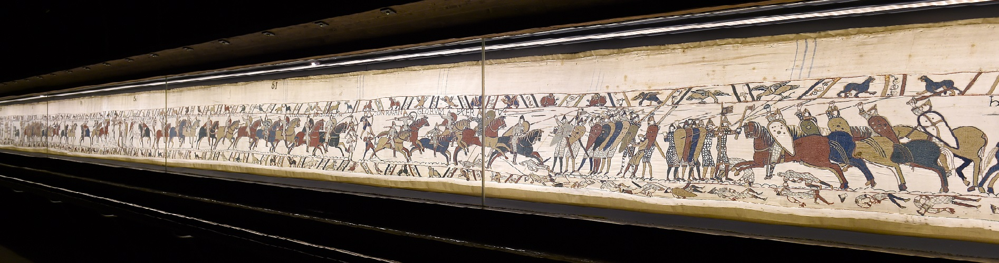
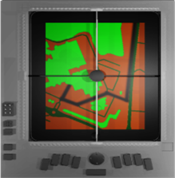
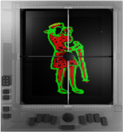
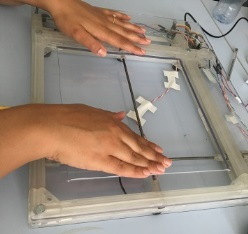
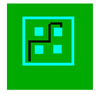
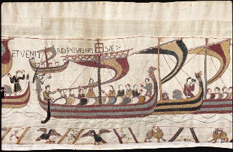
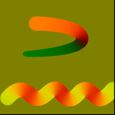

# Projet « GUIDE MUSEAL » soutenu par la Région Normandie (France) - 2019-2022

## Objectif du projet

Le projet « Guide Muséal » vise à concevoir, à réaliser et à valider le prototype académique d’un dispositif numérique permettant l’accès tant à l’espace muséal (mobilité indépendante) qu’aux œuvres qui y sont exposées (accessibilité informative et esthétique) dans une démarche inclusive (pour voyants et personnes présentant une incapacité visuelle, PPIV). Le Musée de la Tapisserie de Bayeux et sa broderie (figure 1) constituent un éco système pour mener les travaux expérimentaux.

## Contexte

L’accès aux objets d’art des musées est limité non seulement pour les PPIV, et plus généralement les personnes en situation de handicap, mais pour tous (seniors et enfants inclus). Les musées d’aujourd’hui proposent surtout des guides audio-portables, qui permettent - à partir du numéro attaché à l’œuvre (ou un RFID) - d’entendre un texte préenregistré qui ne contient au mieux qu’une description sommaire de l’œuvre. Par ailleurs, la vue est sollicitée tant pour repérer les œuvres que pour permettre au visiteur de les appréhender. Aussi, ces guides, destinés aux personnes à vue correcte, sont souvent des barrières empêchant aussi les autres visiteurs de se les approprier.
La loi de 2005 sur le handicap a suscité une multiplication des ateliers tactiles organisés par les musées mais ces ateliers sont surtout une introduction à la perception des matériaux utilisés par les artistes (textures) et aux représentations, souvent simplifiées, de certaines sculptures. La PPIV explore séquentiellement un objet complexe et essaie d’intégrer un ensemble d’éléments disparates en une représentation mentale unifiée d’un objet : il lui faut du temps, de l’énergie, de la concentration, ainsi que le sentiment d’être en confiance et en sécurité. Souvent, bien des éléments ne prennent « sens»  qu’avec l’intervention d’une personne qui les voit et qui les décrit.

Aucun support n’existe pour représenter tout objet d’art avec un affichage modifiable. Par ailleurs, les indices-types permettant de comprendre et de reconnaître rapidement un objet 2D représenté uniquement de façon tactile, sont très difficiles (voire impossibles) à représenter sur les supports classiques non-modifiables, car il n’est possible de changer ni la représentation de l’œuvre ni son échelle.

## Approche retenue : Guide Muséal ou système numérique multimodal portable.

Le guide (figure 2) est une tablette à écran classique sur laquelle une armature spécifique (dotée de différents boutons fonctionnels) et d’un micro-joystick mobile ont été fixés. A l’écran une carte ou l’image d’un objet d’art peut être affichée. Une paire de lunettes munie d’une caméra (pour l’acquisition des images des objets d’art) complète le guide. 
Le guide est doté de différents modes de fonctionnement (chacun activable grâce à un bouton de l’armature): 
+ programmation (planification du parcours), 
+ carte (pour comprendre l’organisation global de l’espace), 
+ navigation (assistance du déplacement - pour atteindre une salle/un objet d’art/un lieu - similaire à un GPS), 
+ image (affichage tactile de l’objet d’art avec des possibilités de modifications), etc. 
L’armature constitue l’interface qui permettra de percevoir, en explorant (de façon libre ou guidée) avec un doigt posé sur son joystick, une représentation tactile simplifiée, mais interactive, de l’information affichée à l’écran. Cette représentation sera accompagnée d’une description audio ad hoc.

  | | 
-------------------------|-------------------------|-------------------------
Figure 2. a) Modèle avec une carte| b)  Modèle avec un detail de la tapisserie | b)  Premier prototype

Par ailleurs, un ensemble de maquettes 3D de certaines scènes de la Tapisserie de Bayeux sera réalisé (reconstruction par des approches originales) avec impression 3D afin d’assister l’apprentissage du processus de compréhension de l’objet d’art.

## Originalités : accessibilité à l’espace muséal et accessibilité esthétique.
Le Guide muséal offre donc l’accès à l’espace muséal, et notamment l’assistance à la navigation dans cet espace, à l’instar d’un GPS, mais à la différence qu’il fonctionne à l’intérieur (ce que le GPS ne fait pas) et à l’extérieur. La figure 3 propose l’affichage visé sur le Guide du plan tactile d’un niveau d’un musée avec ses 4 salles, et le chemin (en noir) qui permettra d’atteindre l’une d’entre elles.

Figure 3. Plan d'un niveau de musée affiché sur le Guide muséal

 
Le Guide Muséal permet de créer de nouvelles expériences esthétiques, qui induisent des stimulations sensorielles inédites et qui sollicitent la pensée et l’imagination, et de les partager avec les autres. En effet, il est possible de faire ressentir tactilement les éléments dynamiques perceptibles à l’œil dans l’œuvre d’art (par exemple, faire apprécier la force du vent qui gonfle les voiles d’un bateau, ou la force des vagues de la mer, cf. figure 4).  Aussi, le système permet la création de nouvelles impressions esthétiques chez toute personne, ce qui renforce l’accessibilité esthétique à l’objet d’art, et d’en fait un guide muséal inclusif.

  |
-------------------------|-------------------------
Figure 4. a) Modèle avec une carte| b)  une représentation haptique du vent dans la voile et de l’ondulation des vagues 

