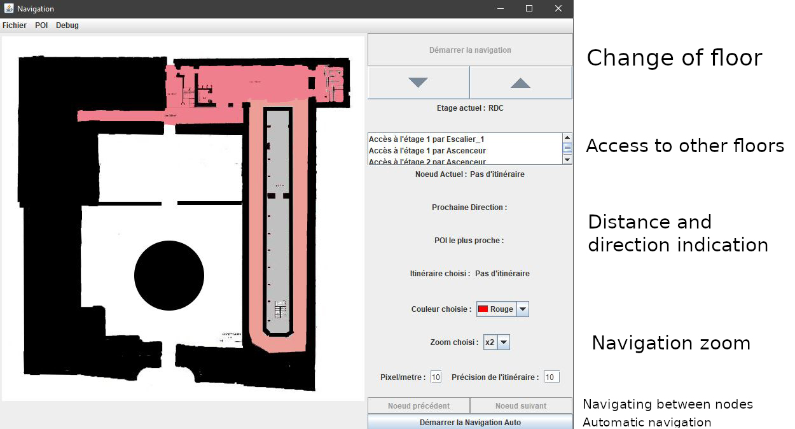

# Navigation project

The navigation project aims to improve the navigation of people with visual impairments.

For this it is divided into several modules:
+ a module allowing the generation of a graph from a plan
+ a module allowing to manually place points of interest on a map
+ a module allowing navigation in a map

The route used in navigation has the following specifics:
+ It can be multi-storey (by connecting 2 points of interest located on different storeys)
+ It can be defined in several sections in succession
+ It can have a modifiable resolution (zoom)

 

Navigation is centered on the user (ego-centered) by providing him with the necessary information:
+ audio indication of the direction and the distance to the next stage (node ​​of the navigation graph)
+ preventive indication before crossing a door
+ indication of the nearest point of interest

## Demonstration video

 
  <iframe style="width:100%;"
  width="560" height="315" 
  src="https://www.youtube.com/embed/lRsYAf_5ykE" frameborder="0" allow="accelerometer; autoplay; encrypted-media; gyroscope; picture-in-picture" allowfullscreen></iframe>

