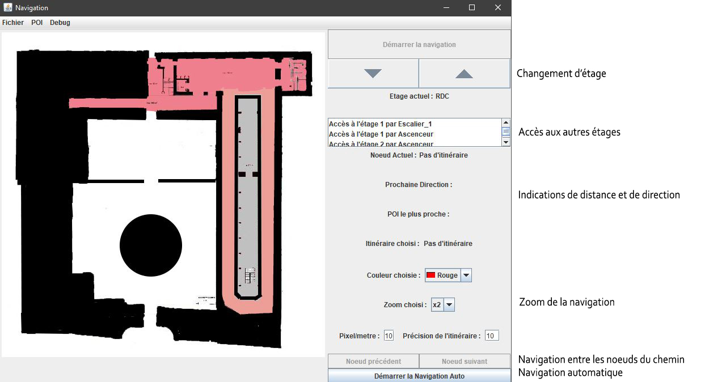

# Projet de navigation

Le projet de navigation vise à améliorer la navigation des personnes souffrant d'incapacité visuelle.

Pour cela il est divisé en plusieurs modules :
+ un module permettant la génération d'un graphe à partir d'un plan
+ un module permettant de placer manuellement des points d'intérêt sur un plan
+ un module permettant la navigation dans un plan

L'itinéraire utilisé dans la navigation possède les spécifités suivantes :
+ Il peut être multi-étage (en reliant 2 points d'intérê d'étages différents entre eux)
+ Il peut être défini en plusieurs fois
+ Avec une précision modifiable

 

La navigation se veut centrer sur l'utilisateur en lui apportant les informations nécessaire à celle-ci :
+ indication audio de la direction et de la distance vers la prochaine étape
+ prévention lors du franchissement des portes
+ indication du POI le plus proche